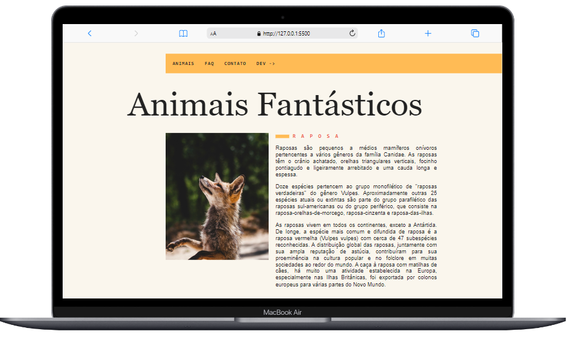
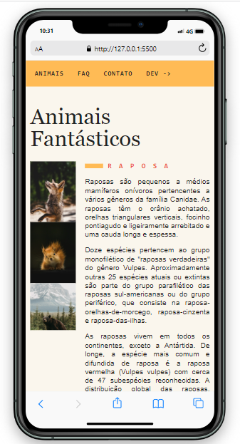

<a id='ancora'></a>
# Animais Incríveis - Origamid 🚀

<br><br>

- [Sobre o Projeto](#ancora1) <br>
- [Competências Desenvolvidas](#ancora2) <br>
- [Execução](#ancora3) <br>
- [Desenvolvedora](#ancora4)

<br><br>


<a id="ancora1"></a>
## Sobre o Projeto ✔️

<br>

A principal idéia era criar um site utilizando Bootstrap como ferramenta, simulando uma página de skate.

<br><br>

Para ajudar nos atendimentos, eles precisam de uma API que permita criar registros de
psicólogos, pacientes e prontuários. Em uma conversa com os Front-end e os PO foram
decididos alguns grupos de endpoints que devem ser criados.

<br>

<a id="ancora2"></a>
## Competências Desenvolvidas 📝

<br>

* HTML
* CSS;
* Javascript;

<br>


<a id="ancora3"></a>
## Execução 💻



 


<br>

Repositório remoto:
```
https://github.com/Karolinegaia/animais-incriveis
```
<br>
<a id="ancora4"></a>
## 🤝 Desenvolvedora

Projeto desenvolvido por:
<table>
  <tr>
    <td align="center">
      <a href="https://www.linkedin.com/in/karoline-gaia-alexandre-919b31120">
        <br>
        <sub>
          <b>Karoline Gaia Alexandre</b>
        </sub>
      </a>
    </td>
</table>